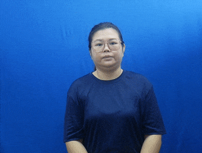
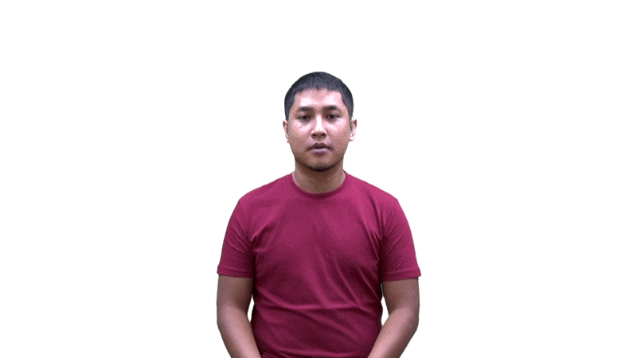
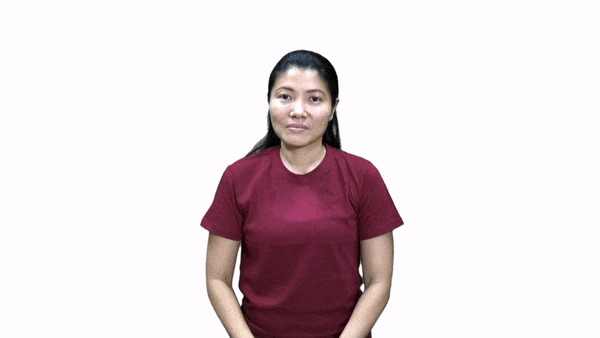
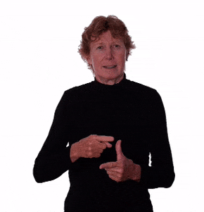
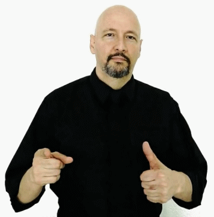

#+TITLE: LL5001 Singapore Sign Language 1 Cheat Sheet
#+AUTHOR: Hankertrix
#+STARTUP: showeverything
#+OPTIONS: toc:2

Reference: [[https://blogs.ntu.edu.sg/sgslsignbank/signs/][SGSL Sign Bank]]

* Definitions

** Agent gesture
The agent gesture is to show a box with both hands and move the box down.
This gesture used to turn change an action, into a person doing the action. For example, teach + agent gesture = teacher.

[[./images/teacher.gif]]

** "Wh" facial expression
This expression is usually used when asking a question, and can be shown as "furrowing" the eyebrows a bit, with the head tilted slightly backwards, and the body leaning towards the respondent.

** Signing area
The signing area refers to the area from the top of your head to the bottom of your waist.

** Tense markers
- Time in sign language is not indicated through tenses, and the verbs in sign language do not change in form when tenses change.
- For example the sign for "eat" and "ate" are the same.
- Time is therefore indicated through the use of adverbs of time.

* Alphabet

** American sign language
[[./images/american-sign-language-alphabet.jpg]]

** Singapore sign language
[[./images/singapore-sign-language-alphabet.png]]

The hand sign for T is slightly different in Singapore Sign language, with the thumb touching the underside of the index finger instead of the thumb being in between the index and middle finger.

* Numbers

** Number
[[./images/number.gif]]

** 1 to 10
[[./images/sign-language-numbers-1-10.png]]

** 11
[[./images/number-eleven.gif]]

** 12
[[./images/number-twelve.gif]]

** 13
[[./images/number-thirteen.gif]]

** 14
[[./images/number-fourteen.gif]]

** 15
[[./images/number-fifteen.gif]]

** 16
[[./images/number-sixteen.gif]]

** 17
[[./images/number-seventeen.gif]]

** 18
[[./images/number-eighteen.gif]]

** 19
[[./images/number-nineteen.gif]]

** 20
[[./images/number-twenty.gif]]

** 21
[[./images/number-twenty-one.gif]]

** 22 to 99
Similar to the number "21", just show the first number followed by the second number.

** 100 (hundred)
[[./images/hundred.gif]]

** 1,000 (thousand)
[[./images/thousand.gif]]

** 1,000,000 (million)
[[./images/million.gif]]

** 1,000,000,000 (billion)
[[./images/billion.gif]]

** 1,000,000,000,000 (trillion)
Same motion as the billion hand sign, but with a "T" hand sign instead of a "B" hand sign.

* Days of the week

** Monday
[[./images/monday.gif]]

** Tuesday
[[./images/tuesday.gif]]

** Wednesday
[[./images/wednesday.gif]]

** Thursday
[[./images/thursday.gif]]

** Friday
[[./images/friday.gif]]

** Saturday
[[./images/saturday.gif]]

** Sunday
[[./images/sunday.gif]]

* Months of the year

** January
[[./images/january.gif]]

Jump a "J" hand sign over the open palm facing inwards with fingers pointing upwards.

** February
[[./images/february.gif]]

** March
[[./images/march.gif]]

** April
[[./images/april.gif]]

** May
[[./images/may-month.gif]]

Jump an "M" hand sign over the open palm facing inwards with fingers pointing upwards, then transition to a "Y" hand sign.

** June
[[./images/june.gif]]

Jump a "J" hand sign over the open palm facing inwards with fingers pointing upwards, then transition to an "E" hand sign.

** July
[[./images/july.gif]]

Jump a "J" hand sign over the open palm facing inwards with fingers pointing upwards, then transition to an "Y" hand sign.

** August
[[./images/august.gif]]

Jump an "A" hand sign over the open palm facing inwards with fingers pointing upwards, then transition to an "G" hand sign.

** September
[[./images/september.gif]]

** October
[[./images/october.gif]]

** November
[[./images/november.gif]]

Jump an "N" hand sign over the open palm facing inwards with fingers pointing upwards.

** December
[[./images/december.gif]]

* Mathematical symbols

** Add (plus)
[[./images/add-math.gif]]

** Subtract (minus)
[[./images/subtract-math.gif]]

** Multiply (times)
[[./images/multiply-math.gif]]

** Divide
[[./images/divide-math.gif]]

** Equal
[[./images/equal-math.gif]]

** Percent (percentage)
[[./images/percent-math.gif]]

** To the power of
The example below shows 2^4, or 2 to the power of 4.

[[./images/to-the-power-of-math.gif]]

** Decimal point

*** Variation 1
Just point your index finger on one hand straight in front to show a dot.

*** Variation 2
[[./images/full-stop-symbol.gif]]

* Vocabulary

** I
Point to your chest.

** Me
Same as "I".

** My
[[./images/my.gif]]

** Mine
Same motion as "my", but do it twice.

** You
Point to the other person.

** Your
[[./images/your.gif]]

** Yours
Same motion as "your", but do it twice.

** We
Point using the index finger from the shoulder on the far side to the other.

** Faculty
Same motion as "we", but form the "F" hand sign instead.

** Our
Form a cup with one hand and touch the side of the pinky on the shoulder on the far side. Then, trace a semicircle before touching the side of the thumb on the other shoulder.

** He
[[./images/he.gif]]

** She
[[./images/she.gif]]

** Yes
[[./images/yes.gif]]

The "yes" gesture must include the head nod together with the hand gesture.

** No
[[./images/no.gif]]

The "no" gesture must include the head shake together with the hand gesture.

** Hello
Do a salute and then pull your hand out with a smiling face.

** Hi
Just finger spell the word "hi".

** Goodbye
Wave goodbye.

** Who
[[./images/who.gif]]

** What

*** Variation 1
[[./images/what-variation-a.gif]]

This variation is usually used at the start of a sentence, like the formal "What is your name?".

*** Variation 2
[[./images/what-variation-b.gif]]

This variation is usually used at the end of a sentence, like the casual "Your name what?".

** Where
[[./images/where.gif]]

Where is usually used at the end of a sentence, so "Where do you live?" becomes "You live where?".

** When
[[./images/when.gif]]

** Which
[[./images/which.gif]]

** How
Bring up a wave from your chest using your palm. At the end of the motion, your fingers should be pointing outwards with your palms facing up.

** How much?
[[./images/how-much.gif]]

** This
[[./images/this.gif]]

** That

** Plane / Aeroplane / Aerospace
Fly the "that" hand sign over your head.

** Fly

*** Variation 1
Same motion as "plane", but move your hand back down to your chest height, drawing a semicircle over your head with your hand.

*** Variation 2
Flap your hands like you're flapping your wings.

** Good
[[./images/good.gif]]

** Nice / Clean (depends on context)
[[./images/nice.gif]]

** Fine
[[./images/fine.gif]]

** Excuse me
Same motion as "nice / clean", but do it twice.

** Please
[[./images/please.gif]]

** Sorry
Same motion as "please", but with the "S" hand sign, or a closed fist.

** Thank you
Touch your chin with the tip of your open palm facing towards your body and bring it outwards.

** Take care
Either finger spell a "TC", or pretend to grab a tissue from a tissue box, then do the "V" hand sign with both hands, stack them one on top of the other and then draw a horizontal circle.

** If

Just finger spell "if".

** And
[[./images/and.gif]]

** Or
Just finger spell "or".

** Not
[[./images/not.gif]]

** Can
[[./images/can-diagram.gif]]

[[./images/can.gif]]

** Cannot (Can't)
[[./images/cannot.gif]]

** Will
[[./images/will.gif]]

** Do
[[./images/do.gif]]

** Do not (Don't)
[[./images/do-not.gif]]

** Correct / Right
[[./images/correct.gif]]

** Wrong
[[./images/wrong.gif]]

** Favourite
[[./images/favourite.gif]]

** Like
[[./images/like.gif]]

** Dislike
[[./images/dislike.gif]]

** Thing
[[./images/thing.gif]]

** Nothing
[[./images/nothing.gif]]

** Want
[[./images/want.gif]]

** Have
[[./images/have-diagram.gif]]

[[./images/have.gif]]

** Give
[[./images/give.gif]]

** Bring
[[./images/bring.gif]]

** Feel
[[./images/feel.gif]]

** Angry
[[./images/angry.gif]]

** Stress
Put both hands beside your head, palm facing your face, and open and close your fingers.

** More
Make two "O" hand signs with both hands and bring them together.

** All

** Few
[[./images/few.gif]]

** Only
[[./images/only.gif]]

** Both
[[./images/both.gif]]

** Time
[[./images/time.gif]]

** Now
Start with both palms open, with the back of the palm facing front and bring both of them down.

** Morning
[[./images/morning.gif]]

** Afternoon
[[./images/afternoon.gif]]

The hand is pointed diagonally in front.

** Noon
Similar to "afternoon", but the palm faces the side and the arm is vertical instead of diagonally front and upwards.

** Evening
Similar to "afternoon", but lower the hand such that it is pointed straight in front, instead of diagonally front and upwards.

** Night
[[./images/night.gif]]

** Midnight
[[./images/midnight.gif]]

** Tree
[[./images/tree.gif]]

** Under
Put one hand horizontally in front of you with the palm facing down. Then, make the thumbs up hand sign and move it under the palm of the other hand.

** On
[[./images/on.gif]]

Just put one hand on top of the other hand.

** Off
[[./images/off.gif]]

When one hand is already on top of the other hand, remove the hand on top.

** In
[[./images/in-diagram.gif]]

[[./images/in.gif]]

** Out
[[./images/out-diagram.gif]]

[[./images/out.gif]]

** Of
Make two "F" hand signs with both hands, then close the circular part of the hand sign around the other hand's hand sign, interlocking the two hands at the circular part of the hand sign. One hand should have its last three fingers pointing forward, and the other hand should have the last three fingers pointing upwards.

** At
Same motion as the hand sign for "thousand", but instead of the open palm facing the other hand, point the open palm forward and the fingers on the other hand should contact the back of the palm instead.

** Just
[[./images/just.gif]]

** About
[[./images/about.gif]]

** Beside
[[./images/beside.gif]]

** Left (direction)
[[./images/left-direction.gif]]

** Right (direction)
[[./images/right-direction.gif]]

** Between
[[./images/between.gif]]

** Through
[[./images/through.gif]]

** For
[[./images/for.gif]]

** With
[[./images/with.gif]]

** Without
[[./images/without.gif]]

** From
[[./images/from.gif]]

** Always
[[./images/always.gif]]

** Far
[[./images/far.gif]]

** Near
[[./images/near.gif]]

** Much
[[./images/much.gif]]

** Many

*** Variation 1
[[./images/many-variation-a.gif]]

*** Variation 2
[[./images/many-variation-b.gif]]

** Never
[[./images/never-diagram.gif]]

[[./images/never.gif]]

The motion of the gesture looks a bit like a question mark. Make sure to shake your head when doing this gesture.

** Then

** Very
[[./images/very.gif]]

** Up
Make the "U" hand sign and move it upwards.

** Down
Hold up a hand with the palm facing the body and move it downwards.

** To
[[./images/to.gif]]

** Today

*** Variation 1
[[./images/today-variation-a.gif]]

*** Variation 2
[[./images/today-variation-b.gif]]

** Tomorrow
[[./images/tomorrow.gif]]

** Yesterday
[[./images/yesterday.gif]]

** Day
[[./images/day.gif]]

** Week
[[./images/week.gif]]

** Month
[[./images/month.gif]]

** World
[[./images/world.gif]]

** Year
Similar to "world", but with a closed fist instead of the "W" hand sign.

** Past
[[./images/past.gif]]

** Future
[[./images/future.gif]]

** First

** Last

*** Variation 1
[[./images/last-variation-a.gif]]

This variation is used to refer to time, like last week, last month or last year.

*** Variation 2
[[./images/last-variation-b.gif]]

This variation is used to refer to a numerical value, like the last bus, the last hour, the last time.

** Later
[[./images/later.gif]]

** Not yet
[[./images/not-yet.gif]]

** Before
[[./images/before.gif]]

** After
[[./images/after.gif]]

** Early

*** Variation 1
[[./images/early-variation-a.gif]]

*** Variation 2
[[./images/early-variation-b.gif]]

** Late
[[./images/late.gif]]

** Since
[[./images/since.gif]]

** Every
[[./images/every.gif]]

** Next
Jump one palm over the other like jumping a fence. Both palms should be open with the palm facing towards the body.

** Again
[[./images/again.gif]]

** Still
[[./images/still.gif]]

** Ask

*** Variation 1
Make a prayer hand position with your fingers pointed straight forward from your body, then bring your fingers up to your chest.

*** Variation 2
[[./images/ask.gif]]

*** Variation 3
Similar to variation 2, but use only the index finger. The index finger becomes increasingly bent as it reaches its furthest point.

** Say / Hearing person
[[./images/say.gif]]

** Speak

*** Variation 1
[[./images/speak-variation-a.gif]]

*** Variation 2
[[./images/speak-variation-b.gif]]

** Talk
[[./images/talk.gif]]

** Communication
Same motion as "talk", but with the "C" hand sign instead of the index finger.

** Conversation
Same motion as "talk", but with 4 fingers instead of just the index finger.

** Traffic
Similar motion to "talk", but with all five fingers outstretched instead of just the index finger, and your hands should be in front of your chest, instead of below your mouth.

** Text / Message

*** Variation 1
[[./images/text-variation-a.gif]]

*** Variation 2
[[./images/text-variation-b.gif]]

** Help
[[./images/help.gif]]

** Meet
[[./images/meet.gif]]

** Name
[[./images/name.gif]]

** Sit
[[./images/name.gif]]

** See
Make the "V" hand sign, but with the back of the palm facing outwards, and put it beside your eyes. Then move your hand outwards.

** Must / Need / Have to / Require / Necessary / Compulsory
[[./images/must.gif]]

** Understand
[[./images/understand.gif]]

** Forget
[[./images/forget.gif]]

** Remember
[[./images/remember.gif]]

** Think
[[./images/think.gif]]

** Know
[[./images/know.gif]]

** Learn
[[./images/learn.gif]]

** Practice
[[./images/practice.gif]]

** Training
Same as "practice", but with the "T" hand sign instead of the fist.

** Read
[[./images/read.gif]]

** Write
[[./images/write.gif]]

** Draw
[[./images/draw.gif]]

** Work
[[./images/work.gif]]

** Break (verb)
Break as in to break something.

[[./images/break.gif]]

** Break (noun) / Intermission
Break as in to take a break.

[[./images/intermission.gif]]

** Go / Went
[[./images/go.gif]]

** Gone / Missing / Absent / Passed Away / Dead / Extinct
[[./images/gone.gif]]

** Stop
[[./images/stop.gif]]

** Full stop (symbol) / Period (symbol)
[[./images/full-stop-symbol.gif]]

** Buy
[[./images/buy.gif]]

** Pay
Make an open palm with one hand and face it upwards. Form a "P" hand sign with the other hand and flick the middle finger outwards.

** Cost
[[./images/cost.gif]]

** Dollar
[[./images/dollar.gif]]

** Sell
[[./images/sell.gif]]

** Ready
Make two "R" hand signs using both hands with the palm facing outwards, then move both hands to one side.

** Hate
[[./images/hate.gif]]

** Love
[[./images/love.gif]]

** Interpret
[[./images/interpret.gif]]

** Translate
Make the "love" hand gesture, but instead of a closed fist use the "T" hand sign. Your hands should also be in front of your chest, not on your chest. Then rotate your wrists around each other and then expand the "T" hand sign into an index finger pointing to the left and right of you.

** Win
Pretend to hold the flag in one hand, then use the other hand to grab it.

** Miss
Similar motion to "win", but instead of the hand pretending to hold a flag, point an index finger upwards. The other hand tries to grab the index finger but misses.

** Lose
Hold an open palm facing up, and touch a "V" hand sign to that open palm.

** Make
[[./images/make.gif]]

** Manufacture
Same motion as "make", but form the "M" hand sign instead of a fist.

** Lie
Move your hand underneath your chin with the back of the hand facing your chin.

** Better
Brush your palm against the bottom of your chin.

** Program
Similar motion to "December", but jump a "P" hand sign instead of a "D" hand sign.

** Project
Similar to "program", but instead of continuing with the "P" when the hand is at the back of the palm, do the "J" hand sign instead.

** Sign language
[[./images/sign-language.gif]]

** Language
[[./images/language.gif]]
Make two "L" hand signs with the index finger pointing forward on both palms, with the thumbs touching each other, then wiggle them while moving outwards.

** Dress
Start with both open palms facing towards your body and move them all the way down your body.

** Keep
Make two "K" signs with both hands and stack them on top of each other vertically.

** Free
Make two "F" hand signs with both hands and close them to your chest, then open them up like you're flying away.

** Study
[[./images/study.gif]]

** Teach
[[./images/teach.gif]]

** Law
Make an L with one hand then tap the L on the fingers of the other palm, followed by tapping the back of the other palm.

** Course
Same motion as "law", but use the "C" hand sign instead.

** Assistant
[[./images/assistant.gif]]

** Boss
Make the "B" hand sign and hit the near side of your chest with the back of the thumb twice.

** President
[[./images/president.gif]]

** Doctor
[[./images/doctor.gif]]

** Secretary
[[./images/secretary.gif]]

** Accountant
[[./images/accountant.gif]]

** Bank
[[./images/bank.gif]]

** Colour
[[./images/colour.gif]]

** White
[[./images/white.gif]]

** Black
[[./images/black.gif]]

** Grey
[[./images/grey.gif]]

** Yellow
[[./images/yellow.gif]]

** Purple
Same motion as "yellow", but with a "P" hand sign.

** Blue
Same motion as "yellow", but with a "B" hand sign.

** Green
Same motion as "yellow", but with a "G" hand sign.

** Orange
[[./images/orange.gif]]

** Red
[[./images/red.gif]]

** Pink
Same motion as "red", but form a "P" first and use the middle finger to draw the line down from your chin.

** Brown
[[./images/brown.gif]]

** Boy
[[./images/boy.gif]]

** Brother
[[./images/brother.gif]]

** Girl
[[./images/girl.gif]]

** Sister
[[./images/sister.gif]]

** Father
[[./images/father.gif]]

** Grandfather
[[./images/grandfather.gif]]

** Mother
[[./images/mother.gif]]

** Grandmother
[[./images/grandmother.gif]]

** Baby
[[./images/baby.gif]]

** Tall
[[./images/tall.gif]]

** Short (height)
[[./images/short-height.gif]]

** Short (measurement)
[[./images/short-measurement.gif]]

** Thin
[[./images/thin.gif]]

** Fat
[[./images/fat.gif]]

** Big

*** Variation 1
[[./images/big-variation-a.gif]]

*** Variation 2
[[./images/big-variation-b.gif]]

** Young
Push your chest upwards and outwards with your hands (palm facing towards you) and make a happy face.

** Old
Push your head forward and downwards and show a goatee with your hands.

** Beautiful
[[./images/beautiful.gif]]

** Ugly
Cross the index fingers on both hands, forming a cross, the pull both hands away into the "X" alphabet hand sign.

** Light
[[./images/light.gif]]

** Dark
[[./images/dark.gif]]

** Light (weight)
Start with an open palm facing outwards on both hands and use your middle fingers to lift a box up, ending with the palm pointing upwards.

** Heavy
Pretend to hold a box from underneath the box, then show your hands and body being weighed down by the heavy box.

** Kill
[[./images/kill.gif]]

** Die

*** Variation 1
[[./images/die-variation-a.gif]]

*** Variation 2
[[./images/die-variation-b.gif]]

*** Variation 3
[[./images/die-variation-c.gif]]

** Live
[[./images/live.gif]]

** Survive
Same motion as "live", but use the "S" hand sign instead of the "L" hand sign.

** Address
Same motion as "live", but with the thumbs up gesture instead of the "L" hand sign.

** Use
Make the "U" hand sign, then touch the fist twice, moving one direction first before switching to the other direction. The "U" hand sign can either have the palm facing outwards or inwards.

** Deaf
[[./images/deaf.gif]]

** Proud
Point your thumb towards the centre of your body and bring it upwards, starting from your stomach and ending at your chest, while bending your back backwards.

** Lead (as in leader)
Use one hand to grab the other hand, which has an open palm facing your body, and then pull it along.

** Breathe
[[./images/breathe.gif]]

** Eat
[[./images/eat.gif]]

** Food / Eat
[[./images/food.gif]]

** Drink

*** Variation 1
[[./images/drink-variation-a.gif]]

*** Variation 2
[[./images/drink-variation-b.gif]]

*** Variation 3
[[./images/drink-variation-c.gif]]

** Water
[[./images/water.gif]]

** Thirsty

*** Variation 1
[[./images/thirsty-variation-a.gif]]

*** Variation 2
[[./images/thirsty-variation-b.gif]]

** Hungry
[[./images/hungry.gif]]

** Horny
Same motion as "hungry", but do the motion over your chest and do it continuously instead of just twice.

** Scared
[[./images/scared.gif]]

** Friend
[[./images/friend.gif]]

** Buddy
Same motion as "friend", but forming the "B" hand sign with both hands instead.

** Mate
Same motion as "friend", but using the "M" hand sign with the fingers open instead.

** Community
Same motion as "friend", but with a fully open palm.

** Problem
Same motion as "friend", but using the "U" hand sign with the fingers curled, and the contact point is the flat part created by the two fingers instead of the finger pads.

** Class
[[./images/class.gif]]

** Group
Same motion as "class", but form the "G" hand sign with both hands instead.

** Family
Same motion as "class", but form the "F" hand sign with both hands instead.

** Primary
Hold one arm horizontally with the palm facing *down*, then make the "P" hand sign with the other hand and rotate it in a circle below the other palm.

** Secondary
Hold one arm horizontally with the palm facing *up*, then make the "S" hand sign with the other hand and draw a loop above the other palm.

** College
Same motion as "secondary", but with an open palm instead of the "S" hand sign.

** University
Same motion as "secondary", but with the "U" hand sign instead of the "S" hand sign.

** Paper
Hold one open palm facing upwards. This palm will be called the holding palm. Slide the back of the other open palm against the back of the holding palm and lift up slightly, with the fingers pointed in the same direction as the holding palm. Then do the same motion but slide against the front of the holding palm.

** Identity
Make the "I" hand sign and push the thumb side of the hand into the other open palm that is facing outwards.

** Individual
Similar to the agent gesture, but use two pinkies instead and do it twice.

** Spell (finger spell)
[[./images/spell.gif]]

** School
[[./images/school.gif]]

** Toilet
Shake the "T" hand sign.

** Lecture
Put your open palm facing upwards beside your head and push it outwards twice.

** Canteen
Form the "C" hand sign with your palm and touch the far side of your chin before touching the other side of your chin.

** Computer
[[./images/computer.gif]]

** Audio
Rub your fist around your ear.

** Hard-of-hearing
[[./images/hard-of-hearing.gif]]

** Hearing (person)
[[./images/hearing.gif]]

** Dumb
Put your fist on your forehead.

** Mute
Touch all fingers to your throat, with the palm facing downwards.

** Stupid
Put the "V" hand sign on your forehead with the palm side facing outwards.

** Science
Make two thumbs down and act like you are pouring things into a beaker.

** Chemical
Same motion as "science", but with the "C" hand sign instead of the thumbs down gesture.

** Biological
Same motion as "science", but with the "B" hand sign instead of the thumbs down gesture.

** Engineering
Make two "Y" hand signs with both hands and connect them thumb to thumb, with the pinky pointed forward. Then, rotate one hand up and down while the other hand remains still.

** Business
Hold a fist horizontally with one hand, with the palm facing down, then bounce the "B" hand sign left and right on the top side of the fist.

** Social
Rotate the "S" hand sign 360 degrees around an index finger pointing upwards.

** Culture
Same motion as "social", but with the "C" hand sign instead of the "S" hand sign.

** Mechanical
Interlock your fingers with each other, thumb pointed upwards and the palm facing towards your body.

** Machine
Same hand shape as "mechanical", but shake your hands up and down.

** Fax
[[./images/fax.gif]]

** Test

*** Variation 1
[[./images/test-variation-a.gif]]

*** Variation 2
[[./images/test-variation-b.gif]]

** Sky
[[./images/sky.gif]]

** Rain
[[./images/rain.gif]]

** Play
[[./images/play.gif]]

** Game
[[./images/game.gif]]

** Leaf
[[./images/leaf.gif]]

** Bus
[[./images/bus.gif]]

** Drum
Just act like you're playing a snare drum.

** House
[[./images/house.gif]]

** Home
[[./images/home.gif]]

** Floor
[[./images/floor.gif]]

** Bowl
[[./images/bowl.gif]]

** Ball
[[./images/ball.gif]]

** Knob
[[./images/knob.gif]]

** Clown
[[./images/clown.gif]]

** Flower
[[./images/flower.gif]]

** Rose
Same motion as "flower", but with the "R" hand sign instead of the flattened "O" hand shape.

** Bird
[[./images/bird.gif]]

** Duck (noun)
Same motion as "bird", but open and close the all the fingers instead of just the thumb and the index finger.

** Swan
Place one arm horizontally, with the palm facing downwards. Make the flattened "O" hand shape with the other hand and place the elbow on the back of the other palm, mimicking how a swan looks like.

** Dinosaur
[[./images/dinosaur.gif]]

There should also be an arm held horizontally under the arm doing the dinosaur hand sign, such that the dinosaur is moving along the arm.

** Point
Hold one index finger up, pointing upwards, and use the index finger on the other hand to point at it.

** Aim
[[./images/aim.gif]]

** Table
[[./images/table.gif]]

** Coffee
[[./images/coffee.gif]]

** Tea
[[./images/tea.gif]]

** Stand
[[./images/stand.gif]]

** Together
Make two "T" hand signs with both hands and put them together, then draw a horizontal circle with both hands together.

** Dominant
Make two "D" hand signs with both hands with the index finger pointing forward, then move them back and forth.

* Places

** Eunos
[[./images/eunos.gif]]

** New York
[[./images/new-york.gif]]

** Tokyo
[[./images/tokyo.gif]]

** Kuala Lumpur
Just finger spell "KL".
